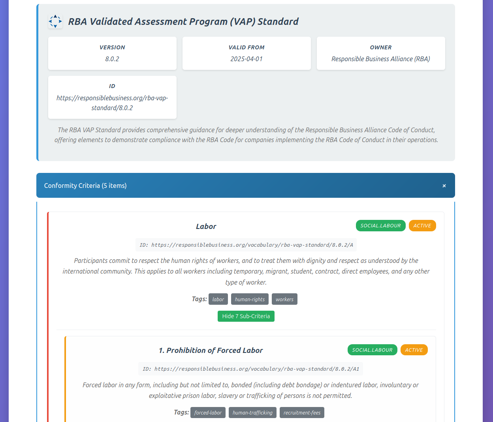

# Sustainable Vocabulary Catalog (SVC) Examples

This directory contains examples of Sustainable Vocabulary Catalog files and a simple viewer to display them, with the ability to drill down through criteria to whatever level is present in the SVC file.



*The SVC Viewer displaying the RBA Validated Assessment Program standard with expandable criteria hierarchy*

The purpose of the repository is to generate and collect initial SVC's that are compliant with the current schema and then incrementally improve their display as needed or requested. No attempt has been made to audit the SVC generation from their respective PDFs.

## Quick Start

To view the SVC files as interactive HTML pages, first either clone the git repository or simply [download the ZIP file of the repo](https://github.com/gs-gs/svc-examples/archive/refs/heads/main.zip) and then:

1. Open `svc-viewer.html` in your web browser
2. Click "Select SVC JSON File" and choose any JSON file from the `catalogs/` directory structure
3. View the interactive content with collapsible sections and expandable criteria hierarchies

**No installation required.** This works offline and doesn't need Python or any web server setup.

## SVC Compliance

Each SVC example is linted using `jsonld lint --safe` and the schema checked with `ajv --spec=draft2020 --strict=false -c ajv-formats -s /path/to/untp-svc-schema-0.6.1.json -d example-svc-file`

TODO: Add a GH action to verify all examples are compliant.

## Contents

- `catalogs/` - Collection of SVC files organized by standards organization:
  - `ResponsibleBusinessAlliance/` - RBA standards including:
    - `ValidatedAssessmentProgram-8.0.2.json` - Standard RBA VAP criteria
    - `ValidatedAssessmentProgram-8.0.2-full.json` - Full RBA VAP with detailed nested sub-criteria
  - `ResponsibleMineralsInitiative/` - RMI standards including:
    - `RiskReadynessAssessment.json` - RMI Risk Readiness Assessment
    - `GlobalResponsibleSourcing-AllMinerals.json` - RMI Global Responsible Sourcing (summary)
    - `GlobalResponsibleSourcing-AllMinerals-full.json` - RMI Global Responsible Sourcing with detailed nested sub-criteria
- `svc-viewer.html` - Standalone HTML viewer for SVC JSON files

### Available Standards

- **RBA Validated Assessment Program** - Comprehensive supply chain compliance verification
- **RMI Risk Readiness Assessment** - Responsible minerals sourcing evaluation
- **RMI Global Responsible Sourcing** - Minerals supply chain due diligence standards

### Generation of SVCs

The SVC examples in this repo were initially created with the following prompt using Claude Sonnet 4:

> Using the JSON schema, instance and context at the following URLs respectively: https://raw.githubusercontent.com/uncefact/spec-untp/refs/tags/v0.6.1/data-models/untp-svc/artefacts/untp-svc-schema.json , https://raw.githubusercontent.com/uncefact/spec-untp/refs/tags/v0.6.1/data-models/untp-svc/artefacts/untp-svc-instance.json , https://raw.githubusercontent.com/uncefact/spec-untp/refs/tags/v0.6.1/data-models/untp-svc/artefacts/context.jsonld , can you create an SVC for the attached document

and attaching the first PDF.

## Publishing a catalog

For publishing at a public location, the SVC viewer can automatically display a specific catalog without requiring file selection. To publish a catalog for direct viewing:

1. **Copy your SVC JSON file** to the same directory as `svc-viewer.html` and rename it to `catalog.json`. You may also want to rename `svc-viewer.html` to `index.html` at your serving location.

2. **Serve the directory** using your webserver, or test with a simple web server:
   ```bash
   # Using Python 3
   python -m http.server 8000

   # Using Python 2
   python -m SimpleHTTPServer 8000

   # Using Node.js
   npx serve .

   # Using PHP
   php -S localhost:8000
   ```

3. **Open in browser**: Navigate to `http://localhost:8000/svc-viewer.html` or simply `http://localhost:8000/` if you renamed the html file to `index.html`.

The viewer will automatically detect and display `catalog.json` without showing the file selector. If `catalog.json` is not present, it falls back to the normal file selection interface.

### Customization

You can customize the appearance by modifying the CSS styles in the HTML file.

This approach is fine for:
- **Demonstrations**: Show a specific catalog to stakeholders
- **Documentation**: Embed in websites or documentation
- **Sharing**: Distribute a complete, self-contained viewer

If you want to publish multiple catalogs then it would be better to:
1. Extract the CSS style to a separate file,
2. Serve the HTML with server-side rendering that sets the catalog to load and stylesheet to use based on the request location.

This will enable a single html file to be maintained while the presentation branded for each catalog as required.

## About SVC

Sustainable Vocabulary Catalog (SVC) is a structured format for defining conformity schemes and their criteria. Read more at [UNTP Sustainable Vocabulary Catalog](https://uncefact.github.io/spec-untp/docs/specification/SustainabilityVocabularyCatalog).

## Requirements

- Modern web browser (Chrome, Firefox, Safari, Edge)

## Troubleshooting

**Problem**: File selector doesn't work
**Solution**: Make sure you're using a modern browser. Some older browsers may not support the file API.

**Problem**: Large JSON files load slowly
**Solution**: This is normal for very large files. The viewer processes everything client-side for security.

**Problem**: Can't view files
**Solution**: Ensure the JSON files are valid. The viewer will show an error message if the JSON is malformed.

**Problem**: `catalog.json` doesn't auto-load
**Solution**: Make sure you're serving the directory with a web server (not opening the HTML file directly). The auto-loading feature requires HTTP access to work due to browser security restrictions.
